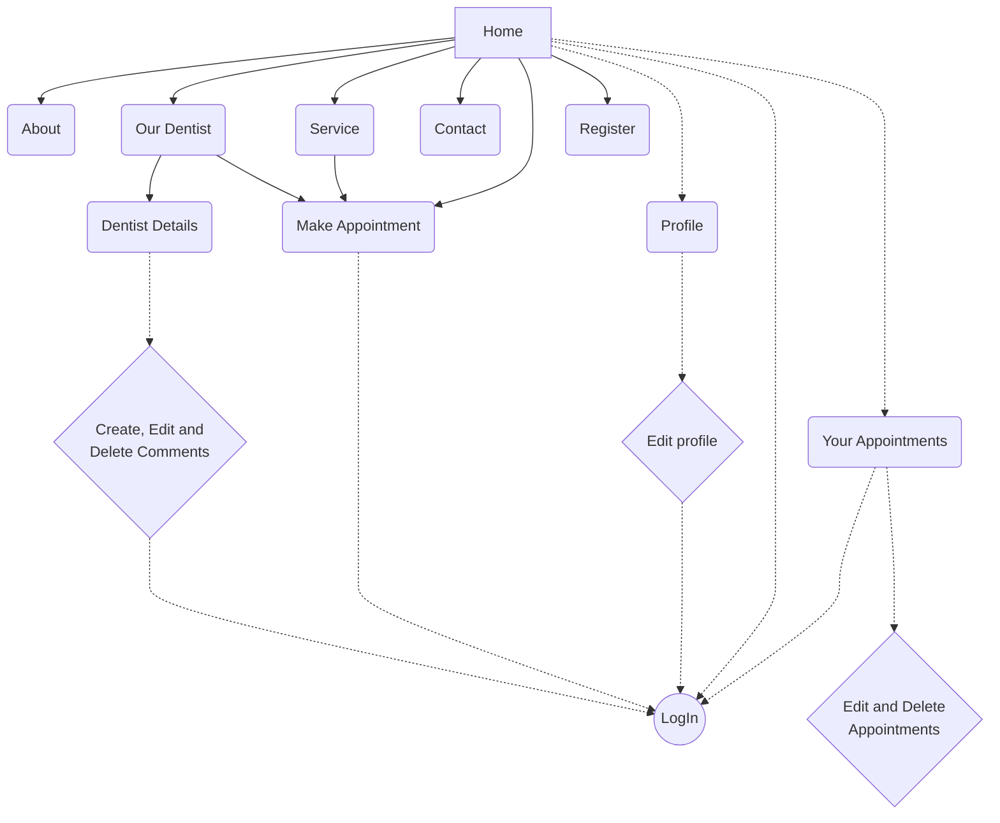

# Welcome to My ReactJS SoftUni project!

**This project is only for education purposes!**

# Presentation

The DentCare website is designed for dental clinics, dentists, labs, and similar healthcare providers. It includes sections and features to showcase the following types of information about a clinic and its services:

-   **Appointments:** A prominent modal appointment form with date and time pickers allows patients to schedule visits easily. The ability for users to edit and remove appointments.
-   **Services/Offerings:** Although specific services aren't listed in the description, the template is built for dental practices, implying sections to detail various dental services offered. It includes a **Pricing Table** feature to clearly display costs.
-   **Credibility:** A **Comments** section is available to display patient reviews.
-   **Contact/Location:** Features like a **UI Contact Form**, **Google Maps integration**, and **Footer Widgets** help provide contact details and location information.
-   **Calls to Action:** Includes elements like "Call to Action" buttons and an "Email Subscription" widget.
-   **User Action:** Patient profile registration and editing.

Essentially, the website provides the structure for a clinic to present its services, allow online booking, display pricing and comments, and share contact information.

## Others

Original HTML template is here: [HERE](https://www.free-css.com/free-css-templates/page287/dentcare){:target="_blank"}

During the development, I modified the original SoftUni Practice Server to implement a users update functionality and to fix a usage of X-Admin header without identification.

## Requirements

NodeJS: 23.8.0  
Vite: 6.2.0  
ReactJS: 19.0.0  
React-Dom: 19.0.0  
React-Router: 7.4.0  

## Install

Install dependencies in /client directory via **npm install** and then run a development web server with **npm run dev**. You must to run a server.js from /server directory via **node server.js** command.

## Flow chart

